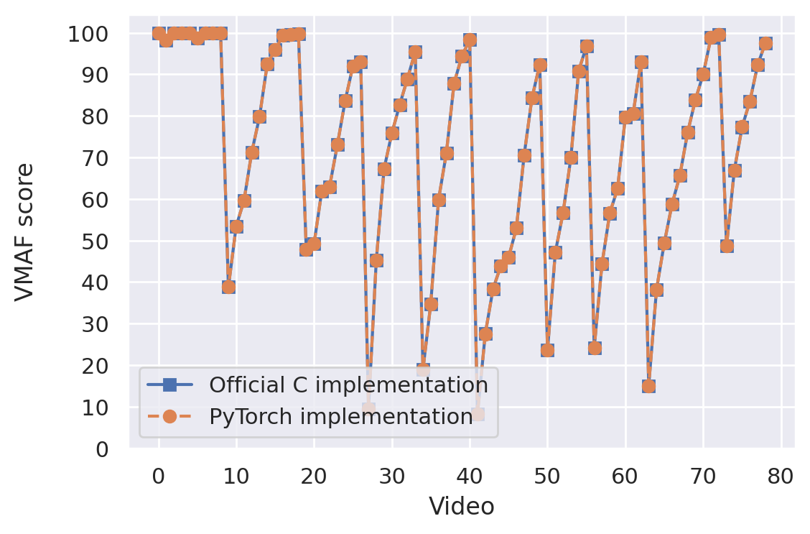
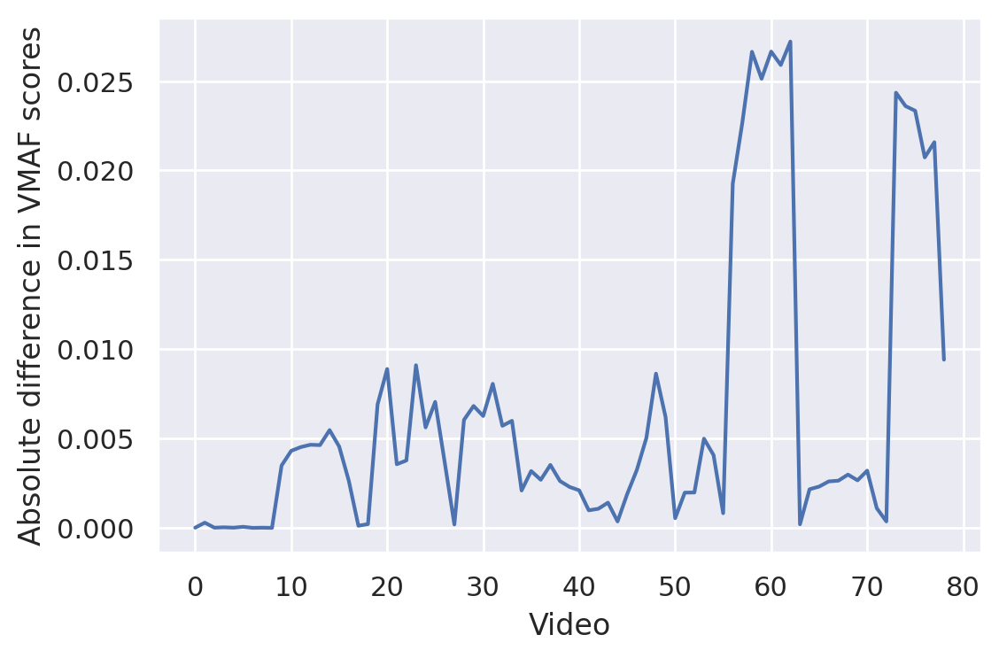

## VMAF PyTorch


Kirill Aistov, Maxim Koroteev

This is an (unofficial) PyTorch implementation of VMAF (Video Multi-Method Assessment Fusion) video quality metric based on [the official C implementation](https://github.com/Netflix/vmaf).

## Installation
```
git clone https://rnd-gitlab-msc.huawei.com/cloud-bu-algorithm-common-project/multimedia-data-reduction/vmaf-torch
cd vmaf-torch
pip install -r requirements.txt
python setup.py develop
```
## Usage
Initialize
```
from vmaf_torch import VMAF
vmaf = VMAF()                            # init vmaf class
vmaf = vmaf.to(device)                   # move internal tensors to GPU
vmaf = vmaf.compile()                    # optionally use .compile() for up to 30% inference speed up, requires torch>=2.0, first pass might take ~30 seconds
```
Load yuv files
```
from vmaf_torch.utils import yuv_to_tensor  

# load reference video Y channel as [num_frames,1,h,w] tensor in [0,255] range                  
ref = yuv_to_tensor('BigBuckBunny_25fps.yuv', 1920, 1080, num_frames=50, channel='y')  
ref = ref.to(device)

# load distorted video Y channel as [num_frames,1,h,w] tensor in [0,255] range
dist = yuv_to_tensor('BigBuckBunny_20_288_375.yuv', 1920, 1080, num_frames=50, channel='y')  
dist = dist.to(device)
```

Compute VMAF score
```
vmaf(ref, dist)       # order of arguments matters
```
Compute elementary features
```
vmaf.compute_adm_features(ref, dist)
vmaf.compute_vif_features(ref, dist)
vmaf.compute_motion(ref)
```

## Difference with the official implementation

We tried to reproduce all details of the original implementation, however some difference in outputs is possible due to the fact that the original uses quantized integer values and this implementation uses floats.

Comparing with [the official Netflix implementation](https://github.com/Netflix/vmaf) on [Netflix Public Dataset](https://github.com/Netflix/vmaf/blob/master/resource/doc/datasets.md) that includes 79 video streams (using first 50 frames from each video), so the plot below contains 79 points, each obtained by averaging over 50 numbers: 



 
Absolute differences' statistics are as follows: 
```
min: 8.7e-07
max: 0.0272
mean: 0.0063
std: 0.0079
```
To reproduce these numbers see `vmaf_compare_implementations.ipynb`

## Notes

* To ensure that gradients are computed correctly we perform gradient checking, see `vmaf_gradient_checking.ipynb`. For details refer to the arxiv paper.

* Note that with `clip_score=True` (which is the default behaviour of official VMAF implementation) it is possible to get gradients equal to 0 in some cases since clipping operation has derivative equal to 0 on parts of its domain. We recommend setting `clip_score=False` for tasks requiring gradient computation.

* This implementation also includes [VMAF NEG](https://netflixtechblog.com/toward-a-better-quality-metric-for-the-video-community-7ed94e752a30) version of the algorithm, use `NEG=True` to enable it. We notice that with `NEG=True` it is also possible to get gradients equal to 0 in some cases due to the nature of this algorithm. We plan to investigate this in more detail in the future.

## Citation
If you use this implementation in your project, please, use the following reference:

```
@misc{vmaf-torch,
      title={VMAF Re-implementation on PyTorch: Some Experimental Results}, 
      author={Kirill Aistov and Maxim Koroteev},
      year={2023},
      eprint={2310.15578},
      archivePrefix={arXiv},
      primaryClass={cs.LG}
}
```
